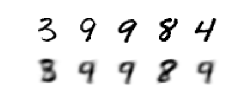
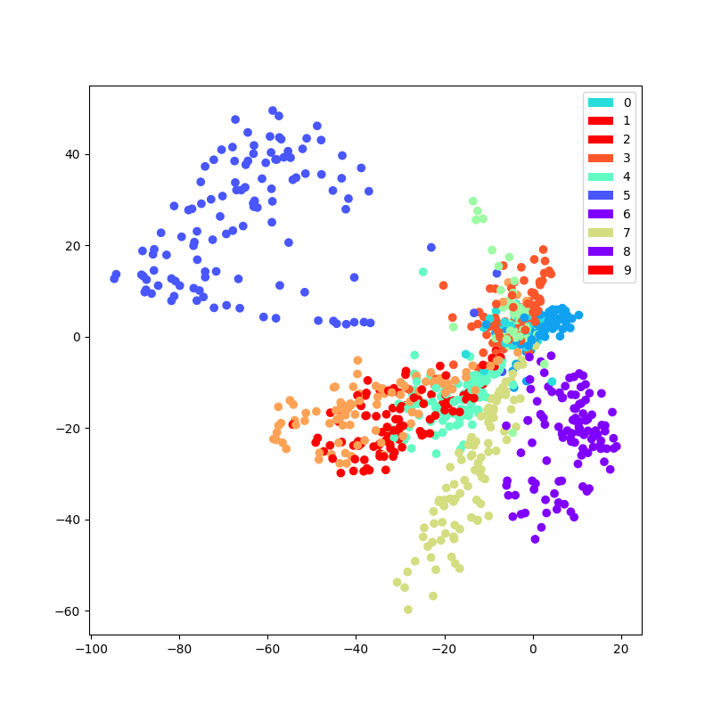
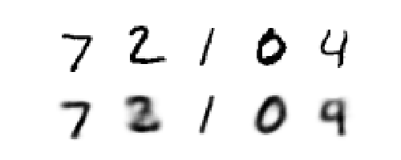
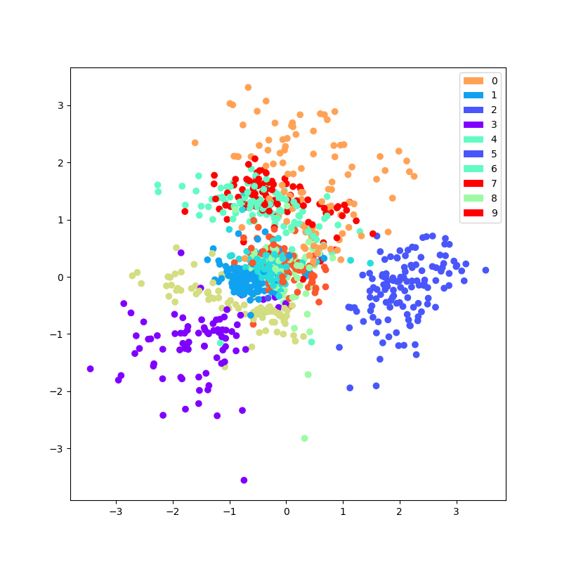
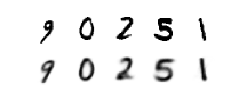
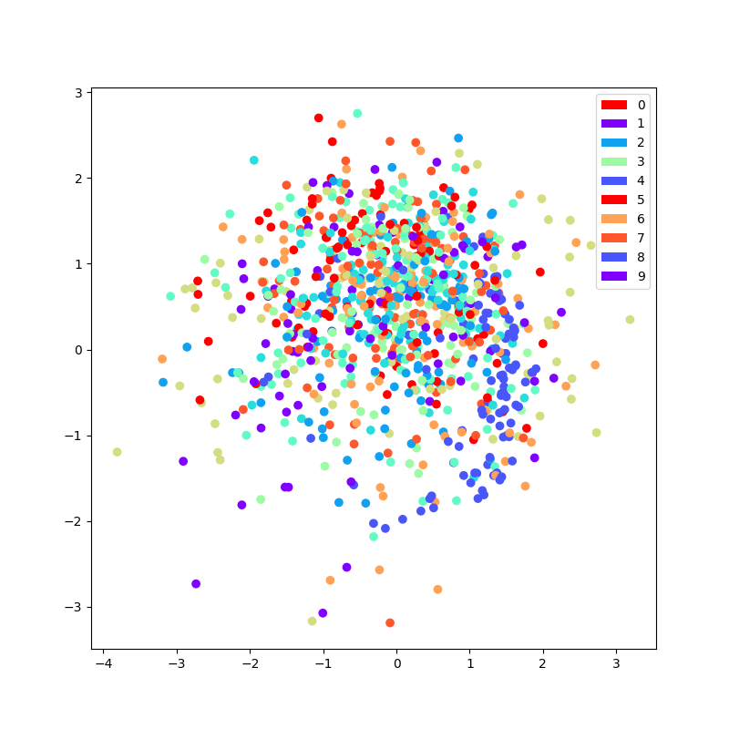
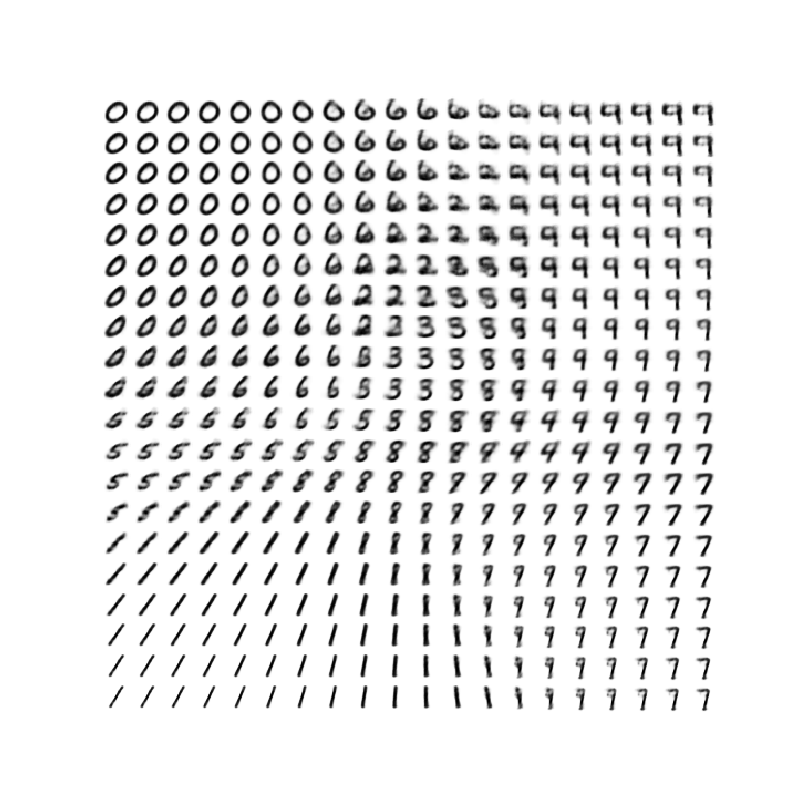
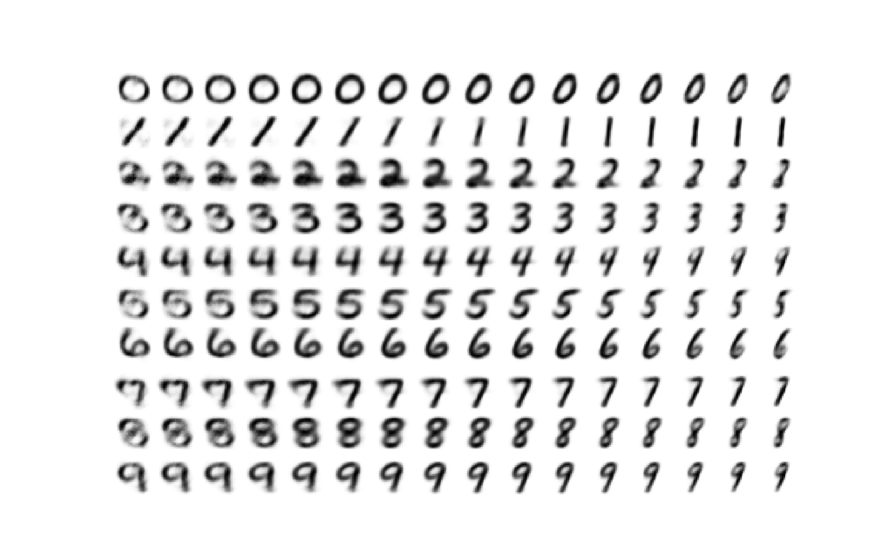

# Auto-Encoders for MNIST: TF 2.0
Implementations of AE(Auto-Encoder), VAE(Variational AE) and CVAE(Conditional VAE)

## Results

### AE(Auto-Encoder)

```
python run_main.py --ae_type AE --num_epochs 150 --latent_dim 2
```

<table>
<tr>
<td>Reconsructed Image</td>
<td></td>
</tr>
<tr>
<td>Distribution of z</td>
<td></td>
</tr>
</table>

### VAE(Variational Auto-Encoder)

```
python run_main.py --ae_type VAE --num_epochs 150 --latent_dim 2
```

<table>
<tr>
<td>Reconsructed Image</td>
<td></td>
</tr>
<tr>
<td>Distribution of z</td>
<td></td>
</tr>
</table>

### CVAE(Conditional Variational Auto-Encoder)

```
python run_main.py --ae_type CVAE --num_epochs 150 --latent_dim 2
```

<table>
<tr>
<td>Reconsructed Image</td>
<td></td>
</tr>
<tr>
<td>Distribution of z</td>
<td></td>
</tr>
</table>

## More Conceptual Plots

### VAE

Visualizations of generated images from (z_1, z_2) ∈ [-2, 2] uniform distribution.



### CVAE

Visualizations of generated images from z_1=0, and z_2 ∈ [-3, 3] uniform distribution.



## Usage

### Prerequisites

1. `tensorflow 2.0.0-alpha0` or higher
2. python packages: `numpy`, `matplotlib`

### Command

```
python run_main.py --ae_type <autoencoder_type>
```

_Example:_ `python run main.py --ae_type AE`

### Arguments

_Required:_

- `--ae_type`: Type of autoencoder, must be in ['AE', 'VAE', 'CVAE']

_Optional:_

- `--latent_dim`: Dimension of latent vector(z). _Default:_ `2`
- `--num_epochs`: The number of epochs to run. _Default:_ `100`
- `--batch_size`: The size of batch. _Default:_ `1000`
- `--learn_rate`: Learning rate of Adam optimizer. _Default:_ `1e-4`

## References
[1] https://github.com/hwalsuklee/tensorflow-mnist-VAE
[2] https://www.slideshare.net/NaverEngineering/ss-96581209
[3] https://www.tensorflow.org/alpha/tutorials/generative/cvae
